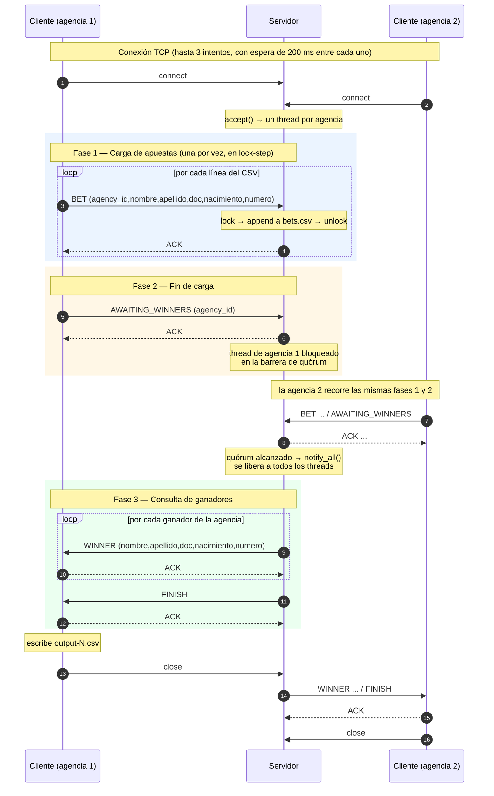

# Informe — TP0: Middleware y Comunicación

## Iván Loyarte - 97213

---

## 1. Comunicación y Protocolo

### 1.1 Formato de mensaje

Todos los mensajes se envían encodeados en bytes a través de un socket.

El mensaje consta de un header y un payload. El envío siempre se realiza en dos tiempos, primero se envía el header y
luego el payload, de tamaño variable. La estructura del mensaje es la siguiente:

| Campo         | Tamaño  | Descripción                               |
|---------------|---------|-------------------------------------------|
| `type`        | 1 byte  | Tipo de mensaje (`MessageType`)           |
| `payload_len` | 4 bytes | Longitud del payload en bytes, big-endian |
| `payload`     | N bytes | Contenido, codificado en UTF-8            |

El header tiene tamaño constante (`HEADER_SIZE = 5`), por lo que el receptor lee primero 5 bytes, decodificar
`payload_len` y recién entonces leer exactamente esa cantidad de bytes. Esto elimina toda ambigüedad sobre dónde termina
un mensaje y empieza el siguiente: **el protocolo no depende de delimitadores ni de que el payload no contenga ciertos
caracteres.**

La serialización del header está definida de forma explícita en ambos lenguajes, con el mismo layout y el mismo
endianness:

- Servidor (`domain/message_header.py`): construcción byte a byte con corrimientos (`(payload_len >> 24) & 0xFF`, …)
- Cliente (`domain/header.go`): construcción byte a byte con corrimientos (`byte(h.PayloadLen >> 24)`, …)

### 1.2 Tipos de mensaje

| Tipo | Nombre             | Emisor   | Payload                                                 |
|------|--------------------|----------|---------------------------------------------------------|
| `1`  | `ACK`              | ambos    | vacío (`payload_len = 0`)                               |
| `2`  | `BET`              | cliente  | `agency_id,nombre,apellido,documento,nacimiento,numero` |
| `3`  | `AWAITING_WINNERS` | cliente  | `agency_id`                                             |
| `4`  | `WINNER`           | servidor | `nombre,apellido,documento,nacimiento,numero`           |
| `5`  | `FINISH`           | servidor | vacío (`payload_len = 0`)                               |

El payload de `BET` incluye el `agency_id` como primer campo (6 campos), mientras que el de `WINNER` lo omite (5
campos): el servidor sólo devuelve ganadores de la agencia que pregunta, por lo que el campo sería redundante y evita
tener un modelo extra para el ganador.

### 1.3 Secuencia de mensajes

La conversación tiene tres fases ordenadas sobre la misma conexión:

**Fase 1 — Envío de apuestas.**

El cliente lee su archivo CSV línea por línea y por cada apuesta envía un `BET` y **espera el `ACK`** del servidor antes
de enviar la siguiente.

**Fase 2 — Notificación de fin de carga.**

Terminado el archivo, el cliente envía
`AWAITING_WINNERS` con su `agency_id` y espera el `ACK`. El cliente queda bloqueado en espera leyendo el socket
esperando los ganadores. Del lado del servidor, se marca el cliente como listo y si alcanza el quorum para que se
dispare la barrera, se despiertan todos los threads de agencia y se procede a la fase 3.

**Fase 3 — Consulta de ganadores.** Cuando el servidor alcanza el quórum de agencias, realiza el sorteo y envía un
mensaje `WINNER` por cada ganador de esa agencia, esperando el `ACK` del cliente entre uno y otro. Al terminar envía
`FINISH`, el cliente responde con un último `ACK` y ambos extremos cierran la conexión. Ese `ACK` final evita que el
servidor cierre el socket sobre un cliente que todavía está leyendo.

Del lado del cliente, si la recepción de ganadores falla a mitad de camino se descarta la lista parcial en lugar de
escribir un archivo de salida incompleto.

### 1.5 Diagrama de acciones



---

## 2. Control y Concurrencia

El servidor atiende a cada agencia en un **thread dedicado**: el hilo principal sólo hace `accept()` y delega la
conexión aceptada a un nuevo `threading.Thread`
(`Server._spawn_agency_thread`)

La sincronización está resuelta mediante el uso de un monitor, la clase `LotteryService` encapsula las operaciones
críticas sobre el estado compartido y la barrera de quórum. El monitor se implementa con un `threading.Condition`:

```python
self._monitor = threading.Condition()
```

En Python, un `Condition` sin argumentos crea internamente su propio `RLock`, por lo que podemos usarlo para atacar
ambos problemas.

### 2.1 Problema 1 — Manejo del archivo bets.csv

**Estado compartido:** el archivo `bets.csv` (a través de `Lottery`) y el conjunto
`_awaiting_agencies`. Ambos son escritos y leídos concurrentemente por todos los threads de agencia.

**Riesgo sin sincronización:** dos threads haciendo `store_bets` en simultáneo pueden intercalar sus escrituras y
producir líneas corruptas en el CSV; y un thread haciendo `load_bets` mientras otro escribe puede leer una línea a medio
escribir y fallar al parsearla.

**Solución:** toda operación sobre ese estado se hace dentro del monitor, de modo que las secciones críticas son
mutuamente excluyentes:

```python
def register_bets(self, bets: list[Bet]) -> None:
    with self._monitor:
        self._lottery.store_bets(bets)


def winners_for(self, agency_id: int) -> list[Bet]:
    with self._monitor:
        self._await_agency_quorum(agency_id)
        return [
            bet
            for bet in self._lottery.load_bets()
            if self._lottery.has_won(bet) and bet.agency_id == agency_id
        ]
```

### 2.2 Problema 2 - Barrera de Quorum

Para obtener la suficiente cantidad de agencias antes de calcular los ganadores se implementó un mecanismo de barrera
simple, cuando un thread llega a la barrera, se registra en `_awaiting_agencies` y si no alcanza el quórum, se bloquea
esperando a que otro thread lo despierte. El primer thread en llegar despierta a todos mediante la Condition del monitor

```python
def _await_agency_quorum(self, agency_id: int) -> None:
    self._awaiting_agencies.add(agency_id)
    if self._agency_quorum_reached():
        self._monitor.notify_all()
        return
    self._monitor.wait_for(self._agency_quorum_reached)


def _agency_quorum_reached(self) -> bool:
    return len(self._awaiting_agencies) >= self._agency_quorum_min
```

El funcionamiento es el siguiente:

1. El thread se registra en `self._awaiting_agencies` 
2. Si con su llegada **no** se alcanza el quórum, el thread se anota al monitor y queda en espera.
3. El primer thread que sí llega a alcanzar el quórum, hace `notify_all()`
   y retorna sin dormirse: es el que "abre" la barrera.
