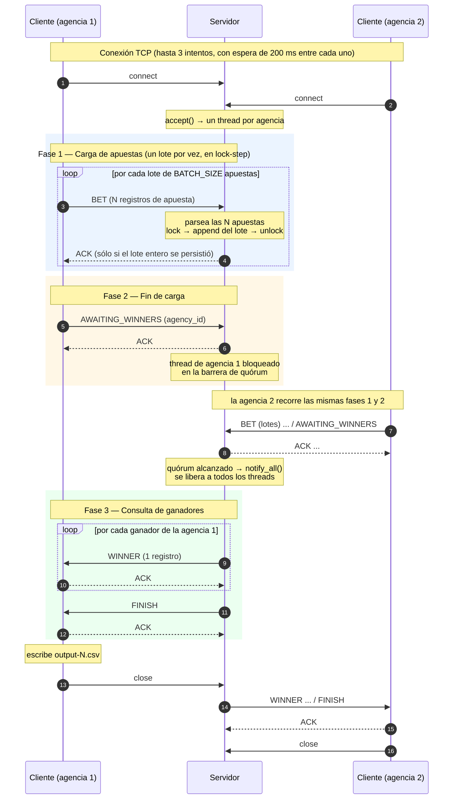

# Informe — TP0: Middleware y Comunicación

## Iván Loyarte - 97213

---

## 1. Comunicación y Protocolo

### 1.1 Formato de mensaje

Todos los mensajes se envían encodeados en bytes a través de un socket.

El mensaje consta de un header de tamaño fijo y un payload de tamaño variable. La estructura es la siguiente:

| Campo         | Tamaño  | Descripción                                      |
|---------------|---------|--------------------------------------------------|
| `type`        | 1 byte  | Tipo de mensaje (`MessageType`)                  |
| `payload_len` | 4 bytes | Longitud del payload en bytes, big-endian        |
| `payload`     | N bytes | Registros separados por `\n`, en UTF-8           |

El header tiene tamaño constante (`HEADER_SIZE = 5`), por lo que el receptor lee primero 5 bytes, decodifica
`payload_len` y recién entonces lee exactamente esa cantidad de bytes. Esto elimina toda ambigüedad sobre dónde termina
un mensaje y empieza el siguiente: **el límite del mensaje no depende de delimitadores ni de que el payload no contenga
ciertos caracteres.**

El header **no** lleva la cantidad de registros del lote. Es un dato redundante: el payload es una secuencia de líneas y
los campos de una apuesta vienen de un CSV de una línea por apuesta, así que ninguno puede contener un `\n` y contar las
líneas del payload da exactamente el tamaño del lote. Un campo `count` sólo agregaba una segunda fuente de verdad para el
mismo dato —más la validación de que ambas coincidan— sin habilitar nada que el payload no diga ya por sí mismo.

Tanto el envío como la recepción se hacen en dos pasos: primero el header y después el payload. En la recepción no hay
alternativa, porque hasta no decodificar `payload_len` no se sabe cuántos bytes pedir; en el envío se mantiene la
simetría con dos `SendAll` / `send_all` sucesivos. Ambas primitivas iteran hasta cubrir todos los bytes pedidos, de modo
que el protocolo es inmune a lecturas y escrituras parciales del socket.

La serialización del header está definida de forma explícita en ambos lenguajes, con el mismo layout y el mismo
endianness:

- Servidor (`domain/message_header.py`): construcción byte a byte con corrimientos (`(payload_len >> 24) & 0xFF`, …)
- Cliente (`domain/header.go`): construcción byte a byte con corrimientos (`byte(h.PayloadLen >> 24)`, …)

### 1.2 Tipos de mensaje

| Tipo | Nombre             | Emisor   | Payload                                                     |
|------|--------------------|----------|-------------------------------------------------------------|
| `1`  | `ACK`              | ambos    | vacío (`payload_len = 0`)                                   |
| `2`  | `BET`              | cliente  | N × `agency_id,nombre,apellido,documento,nacimiento,numero` |
| `3`  | `AWAITING_WINNERS` | cliente  | `agency_id`                                                 |
| `4`  | `WINNER`           | servidor | `nombre,apellido,documento,nacimiento,numero`               |
| `5`  | `FINISH`           | servidor | vacío (`payload_len = 0`)                                   |

`BET` es el único mensaje multi-registro: sus apuestas van separadas por `\n`. Como los campos de una apuesta provienen
de un CSV de una línea por apuesta, ninguno puede contener un salto de línea, así que el separador alcanza para
delimitarlas y el receptor no necesita que el header le anuncie cuántas son.

El payload de `BET` incluye el `agency_id` como primer campo (6 campos), mientras que el de `WINNER` lo omite (5
campos): el servidor sólo devuelve ganadores de la agencia que pregunta, por lo que el campo sería redundante y evita
tener un modelo extra para el ganador.

**No hay un tipo de mensaje para el error.** Si un lote no se puede procesar —un registro mal formado, un fallo al
persistir— el servidor loguea el error, **no** emite el `ACK` y cierra la
conexión. El cliente detecta el EOF mientras espera esa confirmación y aborta la ejecución sin escribir el archivo de
salida. El `ACK` funciona entonces como confirmación de todo-o-nada del lote completo.

### 1.3 Secuencia de mensajes

La conversación tiene tres fases ordenadas sobre la misma conexión:

**Fase 1 — Envío de apuestas.**

El cliente lee su archivo CSV línea por línea, agrupa las apuestas en lotes de `BATCH_SIZE` y por cada lote envía un
único `BET` y **espera el `ACK`** del servidor antes de armar el siguiente. El último lote del archivo se despacha
aunque esté incompleto.

**Fase 2 — Notificación de fin de carga.**

Terminado el archivo, el cliente envía
`AWAITING_WINNERS` con su `agency_id` y espera el `ACK`. El cliente queda bloqueado en espera leyendo el socket
esperando los ganadores. Del lado del servidor, se marca el cliente como listo y si alcanza el quorum para que se
dispare la barrera, se despiertan todos los threads de agencia y se procede a la fase 3.

**Fase 3 — Consulta de ganadores.** Cuando el servidor alcanza el quórum de agencias, realiza el sorteo y envía un
mensaje `WINNER` por cada ganador de esa agencia, esperando el `ACK` del cliente después de cada uno. Si la agencia no
tuvo ganadores no se envía ninguno. Al terminar envía `FINISH`, el cliente responde con un último `ACK` y ambos extremos
cierran la conexión. Ese `ACK` final evita que el servidor cierre el socket sobre un cliente que todavía está leyendo.

El cliente lee en un loop hasta el `FINISH`, acumulando los ganadores que lleguen sin asumir cuántos mensajes son. El
volumen acá es de otro orden que en la carga de apuestas —doce ganadores en total contra casi 79.000 apuestas—, así que
no se justifica batchear esta dirección.

Del lado del cliente, si la recepción de ganadores falla a mitad de camino se descarta la lista parcial en lugar de
escribir un archivo de salida incompleto.

### 1.4 Batching de apuestas

La cantidad de apuestas por lote se configura con la variable de entorno **`BATCH_SIZE`** del cliente, obligatoria como
el resto de sus variables (`AGENCY_ID`, `SERVER_HOST`, `SERVER_PORT`, `INPUT_FILE`, `OUTPUT_FILE`). El script
`scripts/generar-compose.sh` la emite en cada bloque de cliente, con valor por defecto `8` y override por entorno:

```bash
BATCH_SIZE=32 ./scripts/generar-compose.sh 5
```

**Armado del lote.** El cliente sigue recorriendo el archivo con un `bufio.Scanner`, línea por línea: `readBatch`
consume como máximo `BATCH_SIZE` líneas, las parsea y devuelve el lote, que se despacha antes de leer el siguiente. El
archivo nunca se carga entero en memoria: el pico de memoria del cliente queda acotado por el tamaño del lote, no por el
del archivo de entrada, que en el caso de la agencia 1 tiene casi 27.000 apuestas. El último lote se despacha aunque
quede incompleto, y un lote vacío es la señal de fin de archivo.

**Procesamiento del lote.** El servidor parte el payload en líneas (`parse_bets`), parsea todas las apuestas y sólo
entonces hace **una** llamada a `register_bets(bets)`, que persiste el lote completo dentro de una única sección crítica.
Recién ahí emite el `ACK`. Si algo falla —un registro mal formado, un error al escribir— la excepción sube, no hay `ACK`
y la conexión se cierra: la agencia nunca recibe una confirmación por un lote procesado a medias.

**Impacto.** Con la carga completa de las 6 agencias, subir `BATCH_SIZE` de 1 a 8 baja los mensajes intercambiados con
la agencia 1 de 26.937 a 3.368, y proporcionalmente los round-trips de espera del `ACK`.

**Límites.** El techo formal lo pone `payload_len`, que es un `u32`, así que en la práctica el único límite es
`BATCH_SIZE`. El criterio para elegirlo no es ese techo: un lote más grande significa más memoria retenida en ambos
extremos y más trabajo perdido si el lote falla, mientras que uno muy chico devuelve el problema original de un
round-trip por apuesta. Con un registro de ~48 bytes, un lote de 30 apuestas entra cómodo en un solo segmento TCP de una
red con MTU 1500.

### 1.5 Diagrama de acciones



---

## 2. Control y Concurrencia

El servidor atiende a cada agencia en un **thread dedicado**: el hilo principal sólo hace `accept()` y delega la
conexión aceptada a un nuevo `threading.Thread`
(`Server._spawn_agency_thread`)

La sincronización está resuelta mediante el uso de un monitor, la clase `LotteryService` encapsula las operaciones
críticas sobre el estado compartido y la barrera de quórum. El monitor se implementa con un `threading.Condition`:

```python
self._monitor = threading.Condition()
```

En Python, un `Condition` sin argumentos crea internamente su propio `RLock`, por lo que podemos usarlo para atacar
ambos problemas.

### 2.1 Problema 1 — Manejo del archivo bets.csv

**Estado compartido:** el archivo `bets.csv` (a través de `Lottery`) y el conjunto
`_awaiting_agencies`. Ambos son escritos y leídos concurrentemente por todos los threads de agencia.

**Riesgo sin sincronización:** dos threads haciendo `store_bets` en simultáneo pueden intercalar sus escrituras y
producir líneas corruptas en el CSV; y un thread haciendo `load_bets` mientras otro escribe puede leer una línea a medio
escribir y fallar al parsearla.

**Solución:** toda operación sobre ese estado se hace dentro del monitor, de modo que las secciones críticas son
mutuamente excluyentes:

```python
def register_bets(self, bets: list[Bet]) -> None:
    with self._monitor:
        self._lottery.store_bets(bets)


def winners_for(self, agency_id: int) -> list[Bet]:
    with self._monitor:
        self._wait_for_quorum(agency_id)
        return [
            bet
            for bet in self._lottery.load_bets()
            if self._lottery.has_won(bet) and bet.agency_id == agency_id
        ]
```

`register_bets` recibe el lote entero y no una apuesta a la vez, así que un `BET` de `BATCH_SIZE` apuestas toma el
monitor **una sola vez**. Además de ser la unidad natural de la confirmación todo-o-nada descrita en 1.4, esto reduce
proporcionalmente la contención entre los threads de agencia: con `BATCH_SIZE = 8` hay un octavo de las tomas de lock
que con el envío de a una.

### 2.2 Problema 2 - Barrera de Quorum

Para obtener la suficiente cantidad de agencias antes de calcular los ganadores se implementó un mecanismo de barrera
simple, cuando un thread llega a la barrera, se registra en `_awaiting_agencies` y si no alcanza el quórum, se bloquea
esperando a que otro thread lo despierte. El primer thread que alcanza el quórum despierta a todos mediante la Condition
del monitor

```python
def _wait_for_quorum(self, agency_id: int) -> None:
    self._awaiting_agencies.add(agency_id)
    if self._agency_quorum_reached():
        self._monitor.notify_all()
        return
    self._monitor.wait_for(self._agency_quorum_reached)


def _agency_quorum_reached(self) -> bool:
    return len(self._awaiting_agencies) >= self._agency_quorum_min
```

El funcionamiento es el siguiente:

1. El thread se registra en `self._awaiting_agencies` 
2. Si con su llegada **no** se alcanza el quórum, el thread se anota al monitor y queda en espera.
3. El primer thread que sí llega a alcanzar el quórum, hace `notify_all()`
   y retorna sin dormirse: es el que "abre" la barrera.
